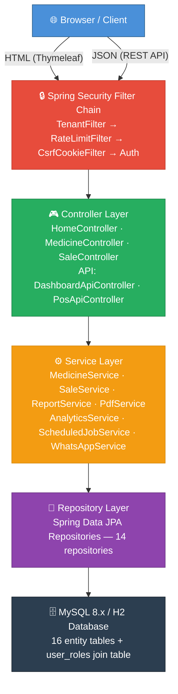
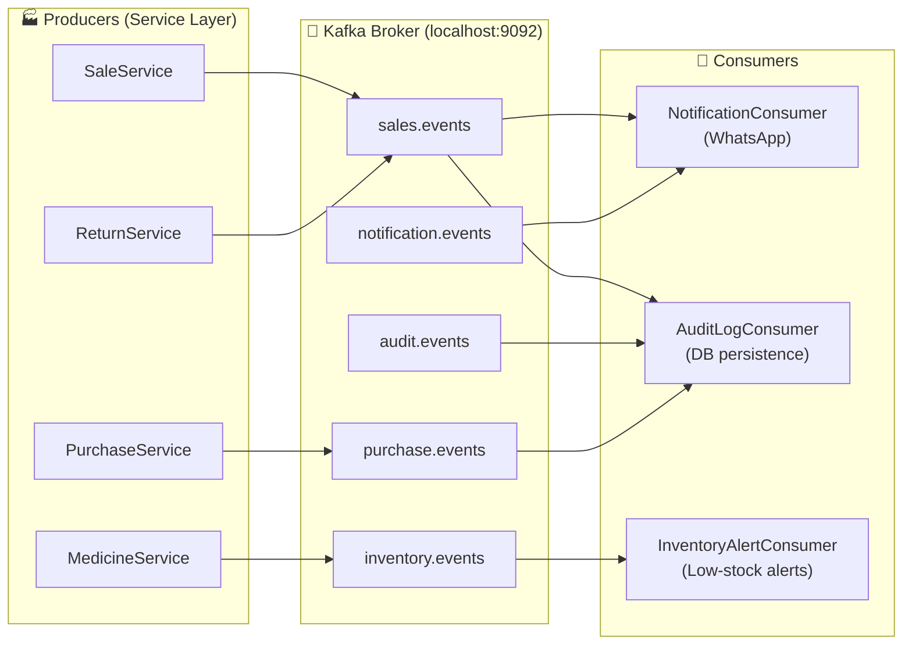

# 💊 MedicalStore — Pharmacy Inventory & Sales Management System

[](https://openjdk.org/)
[](https://spring.io/projects/spring-boot)
[](https://www.mysql.com/)
[](http://localhost:8081/swagger-ui.html)
[](https://github.com/Kt129673/medicalstore/actions/workflows/bug-detection.yml)
[](LICENSE)

A **production-ready**, multi-branch pharmacy management system built with **Spring Boot 3.5**. It covers end-to-end pharmacy operations — from purchase orders and sales billing to analytics dashboards, PDF/Excel reporting, WhatsApp notifications, and subscription-based access control.

---

## 📑 Table of Contents

- [Features](#-features)
- [Tech Stack](#-tech-stack)
- [Architecture Overview](#-architecture-overview)
- [Prerequisites](#-prerequisites)
- [Getting Started](#-getting-started)
- [Configuration](#%EF%B8%8F-configuration)
- [Role-Based Access Control](#-role-based-access-control)
- [Modules](#-modules)
- [API Endpoints](#-api-endpoints)
- [Swagger / OpenAPI](#-swagger--openapi)
- [Actuator / Monitoring](#-actuator--monitoring)
- [MCP Testing Server](#-mcp-testing-server)
- [CI/CD & Bug Detection](#-cicd--automated-bug-detection)
- [Scheduled Jobs](#-scheduled-jobs)
- [Project Structure](#-project-structure)
- [Building & Testing](#-building--testing)
- [Deployment](#-deployment)
- [Documentation](#-documentation)
- [Contributing](#-contributing)
- [License](#-license)

---

## ✨ Features

| Category | Highlights |
|---|---|
| **Inventory Management** | Add/edit/delete medicines, batch tracking, expiry-date alerts, low-stock warnings, dead-stock detection |
| **Sales & Billing** | Point-of-Sale (POS) API, invoice generation (PDF), GST-compliant billing, sale returns & credit notes |
| **Purchase Orders** | Supplier management, purchase order creation, supplier credit tracking |
| **Customer Management** | Customer database, purchase history, credit tracking |
| **Analytics & Reports** | Fast-moving items, profit-per-medicine, daily/monthly/GST reports, profit & loss, multi-branch comparison |
| **PDF & Excel Export** | Invoice PDFs (iText), sales/daily/monthly report PDFs (Velocity templates), Excel exports (Apache POI) |
| **Multi-Branch Support** | Branch-level data isolation via tenant context, owner-level cross-branch dashboards |
| **Role-Based Security** | Three roles — **Admin**, **Owner**, **Shopkeeper** — with hierarchical permissions and feature flags |
| **Subscription Plans** | Tiered access control with plan-based feature gating and auto-expiry enforcement |
| **WhatsApp Notifications** | Twilio-powered WhatsApp alerts for expiry and low-stock notifications |
| **Performance** | Caffeine caching, HikariCP connection pooling, Hibernate batch inserts, API rate limiting (Bucket4j) |
| **Scheduled Jobs** | Automated expiry alerts (daily), subscription enforcement (daily), soft-delete purge (weekly) |
| **Audit Logging** | Comprehensive audit trail for user and role changes |
| **Soft Deletes** | Safe deletion with configurable retention and hard-delete purge |
| **Responsive UI** | Thymeleaf server-rendered pages with a modern, responsive design |
| **REST APIs** | 25+ JSON API endpoints for medicines, sales, customers, suppliers, analytics, and app info |
| **Swagger / OpenAPI** | Auto-generated interactive API documentation at `/swagger-ui.html` |
| **Actuator Monitoring** | Health, info, metrics, caches, and environment endpoints at `/actuator/**` |
| **MCP Testing Server** | Node.js-based Model Context Protocol server for AI-assisted testing |
| **CI/CD Bug Detection** | GitHub Actions pipeline with SpotBugs, PMD, and auto-created GitHub Issues |
| **Event-Driven Architecture** | Apache Kafka (KRaft mode on EC2) for async sales events, inventory alerts, audit logging, and WhatsApp notifications |

---

## 🛠 Tech Stack

| Layer | Technology |
|---|---|
| **Language** | Java 17 |
| **Framework** | Spring Boot 3.5.7 |
| **Web/UI** | Spring MVC + Thymeleaf |
| **Security** | Spring Security 6 (role hierarchy, CSRF, Remember-Me) |
| **Persistence** | Spring Data JPA / Hibernate 6, MySQL 8.x (production), H2 (testing) |
| **Caching** | Spring Cache + Caffeine |
| **PDF Generation** | iText 8 + html2pdf 5 + Apache Velocity templates |
| **Excel Export** | Apache POI 5.2 |
| **Rate Limiting** | Bucket4j 8.1 |
| **Notifications** | Twilio SDK 10.0 (WhatsApp) |
| **API Docs** | SpringDoc OpenAPI 2.8 + Swagger UI |
| **Monitoring** | Spring Boot Actuator |
| **Messaging** | Spring Kafka + Apache Kafka (KRaft mode on EC2) |
| **Static Analysis** | SpotBugs 4.8 + PMD 3.26 |
| **MCP Server** | Node.js + `@modelcontextprotocol/sdk` |
| **CI/CD** | GitHub Actions (build, test, bug detection, deploy) |
| **Cloud** | AWS EC2 t2.micro (app + Kafka), AWS RDS db.t3.micro (MySQL) — **100% Free Tier** |
| **Build Tool** | Maven 3.8+ (with Maven Wrapper included) |
| **Packaging** | WAR (deployable to external Tomcat or embedded) |
| **Code Gen** | Lombok |

---

## 🏗 Architecture Overview



---

## � Kafka Event-Driven Architecture

The application uses **Apache Kafka** (KRaft mode — no Zookeeper) for asynchronous event processing.
Kafka is **100% optional** — controlled by `kafka.enabled` property. When disabled, the app works without a broker.

### Event Flow



### Kafka Topics

| Topic | Events | Partitions |
|---|---|---|
| `medicalstore.sales.events` | `SALE_CREATED`, `SALE_DELETED`, `SALE_RETURNED` | 3 |
| `medicalstore.inventory.events` | `MEDICINE_CREATED`, `MEDICINE_UPDATED`, `MEDICINE_DELETED` | 3 |
| `medicalstore.audit.events` | `USER_CREATED`, `ROLE_CHANGED`, etc. | 2 |
| `medicalstore.notification.events` | `EXPIRY_ALERT`, `LOW_STOCK_ALERT` | 2 |
| `medicalstore.purchase.events` | `PURCHASE_ORDER_CREATED`, `PURCHASE_ORDER_RECEIVED` | 2 |

### Consumers

| Consumer | Listens To | Action |
|---|---|---|
| `NotificationConsumer` | sales, notifications | Sends WhatsApp invoices & alerts via Twilio |
| `AuditLogConsumer` | sales, audit, purchases | Persists audit records to database |
| `InventoryAlertConsumer` | inventory | Detects low-stock and triggers real-time alerts |

### Feature Toggle

```properties
# application.properties
kafka.enabled=${KAFKA_ENABLED:false}    # false = app runs without Kafka
```

---

## ☁️ AWS Free Tier Deployment Architecture

All infrastructure runs within **AWS Free Tier limits** — estimated monthly cost: **$0.00**.

```
┌──────────────────────────────────────────────────────────────┐
│                  EC2 t2.micro (Free Tier)                    │
│                  1 vCPU · 1 GB RAM                           │
│                                                              │
│  ┌────────────────────┐    ┌─────────────────────────────┐  │
│  │  Spring Boot App   │───▶│  Apache Kafka (KRaft mode)  │  │
│  │  -Xmx384m          │    │  -Xmx256m                   │  │
│  │  Port 8081          │    │  Port 9092                   │  │
│  │  (app + consumers)  │    │  (no Zookeeper)              │  │
│  └────────┬───────────┘    └─────────────────────────────┘  │
│           │ JDBC                                             │
│  ┌────────▼──────────────────────────────────────────────┐  │
│  │            AWS RDS db.t3.micro (Free Tier)             │  │
│  │            MySQL 8.x · 20 GB gp2                       │  │
│  └───────────────────────────────────────────────────────┘  │
│                                                              │
│  Swap: 512 MB (safety buffer)                                │
└──────────────────────────────────────────────────────────────┘
```

### AWS Free Tier Verification

| Service | Instance | Free Tier Limit | Our Usage | Cost |
|---|---|---|---|---|
| EC2 | `t2.micro` | 750 hrs/month | ~730 hrs (24/7) | $0 |
| EBS | `gp2` | 30 GB/month | 8 GB | $0 |
| RDS | `db.t3.micro` | 750 hrs/month | ~730 hrs (24/7) | $0 |
| RDS Storage | `gp2` | 20 GB | 20 GB | $0 |
| Data Transfer | Outbound | 100 GB/month | < 5 GB | $0 |
| **Total** | | | | **$0** |

### Services Avoided (Cost Savings)

| ❌ Service | Why Avoided | ✅ Free Alternative |
|---|---|---|
| AWS MSK | ~$200/month | Kafka on EC2 (KRaft mode) |
| NAT Gateway | ~$32/month | Public subnet + Security Groups |
| ALB/NLB | ~$16/month | Direct EC2 public IP |
| ElastiCache | Not Free Tier | Caffeine (in-app cache) |

### Kafka Setup on EC2

Kafka is auto-installed by the `scripts/setup-kafka-ec2.sh` script during deployment:

```bash
# What the setup script does (idempotent):
# 1. Creates 512 MB swap file (safety buffer)
# 2. Installs Java 17 (if missing)
# 3. Downloads Apache Kafka 3.7.0
# 4. Configures KRaft mode (no Zookeeper)
# 5. Creates systemd service (auto-start on boot)
# 6. Sets KAFKA_ENABLED=true for the app
```

---

## �📋 Prerequisites

- **Java 17** (JDK) — [Download](https://adoptium.net/)
- **Maven 3.8+** (or use the included Maven Wrapper `./mvnw`)
- **MySQL 8.x** — [Download](https://dev.mysql.com/downloads/)
- **Apache Kafka** (optional) — auto-installed on EC2 by deploy workflow; or local broker for dev ([Download](https://kafka.apache.org/downloads))
- **Git** — [Download](https://git-scm.com/)

---

## 🚀 Getting Started

### 1. Clone the Repository

```bash
git clone <repo-url>
cd medicalstore
```

### 2. Create the MySQL Database

```sql
CREATE DATABASE medicalstore_db CHARACTER SET utf8mb4 COLLATE utf8mb4_unicode_ci;
```

### 3. Configure Database Credentials

Edit `src/main/resources/application.properties`:

```properties
spring.datasource.url=jdbc:mysql://localhost:3306/medicalstore_db?useSSL=false&serverTimezone=UTC
spring.datasource.username=your_username
spring.datasource.password=your_password
```

### 4. Build & Run

```bash
# Using Maven Wrapper (recommended)
./mvnw clean install
./mvnw spring-boot:run

# Or using system Maven
mvn clean install
mvn spring-boot:run
```

### 5. Access the Application

Open your browser and navigate to:

| URL | Description |
|---|---|
| `http://localhost:8081/` | Home / Dashboard |
| `http://localhost:8081/login` | Login page |

> The application runs on **port 8081** by default. Change it in `application.properties` via `server.port`.

---

## ⚙️ Configuration

All configuration is in `src/main/resources/application.properties`:

| Property | Default | Description |
|---|---|---|
| `server.port` | `8081` | Application port |
| `spring.datasource.url` | *(AWS RDS)* | JDBC connection string |
| `spring.jpa.hibernate.ddl-auto` | `update` | Schema auto-management |
| `spring.cache.caffeine.spec` | `maximumSize=1000,expireAfterWrite=60s` | Cache policy |
| `server.servlet.session.timeout` | `30m` | Session inactivity timeout |
| `scheduler.expiry-alert-days` | `30` | Days ahead for expiry alerts |
| `scheduler.soft-delete-retention-days` | `90` | Retention period before hard-delete |
| `twilio.account.sid` | `YOUR_ACCOUNT_SID` | Twilio Account SID |
| `twilio.auth.token` | `YOUR_AUTH_TOKEN` | Twilio Auth Token |
| `twilio.whatsapp.enabled` | `true` | Enable/disable WhatsApp alerts |
| `management.endpoints.web.exposure.include` | `health,info,metrics,caches,env` | Actuator endpoints to expose |
| `springdoc.swagger-ui.path` | `/swagger-ui.html` | Swagger UI URL path |
| `springdoc.api-docs.path` | `/v3/api-docs` | OpenAPI spec URL path |
| `kafka.enabled` | `false` | Master toggle for Kafka (via `KAFKA_ENABLED` env var) |
| `spring.kafka.bootstrap-servers` | `localhost:9092` | Kafka broker(s) (via `KAFKA_BOOTSTRAP_SERVERS` env var) |
| `inventory.low-stock-threshold` | `10` | Units below which low-stock alerts fire |

---

## 🔐 Role-Based Access Control

The system enforces a **three-tier role hierarchy**:

```
ADMIN  →  Platform governance (manages all users, branches, subscriptions, audit logs)
  │
  ▼  (inherits)
OWNER  →  Portfolio management (multi-branch overview, analytics, reports)
  │
  ║  (does NOT inherit — separate operational scope)
  ▼
SHOPKEEPER  →  Store operations (medicines, sales, purchases, returns, customers)
```

### Permission Matrix

| Feature | Admin | Owner | Shopkeeper |
|---|:---:|:---:|:---:|
| User Management | ✅ | ❌ | ❌ |
| Branch Management | ✅ | ❌ | ❌ |
| Audit Logs | ✅ | ❌ | ❌ |
| Subscription Management | ✅ | ✅ | ❌ |
| Multi-Branch Comparison | ✅ | ✅ | ❌ |
| Advanced Analytics | ✅ | ✅ | ❌ |
| Export Reports (PDF/Excel) | ✅ | ✅ | ❌ |
| Custom Reports | ✅ | ✅ | ❌ |
| Medicine CRUD | ✅ | ❌ | ✅ |
| Sales & Billing | ✅ | ❌ | ✅ |
| Purchase Orders | ✅ | ❌ | ✅ |
| Customer Management | ✅ | ❌ | ✅ |
| Returns | ✅ | ❌ | ✅ |

> Feature access is controlled by both URL-level security (`SecurityConfig`) and runtime feature flags (`FeatureFlags.java`).

---

## 📦 Modules

### Medicine Management
Add, edit, and delete medicines with batch number tracking. View low-stock alerts and expiry warnings. Supports soft-delete so data is never permanently lost.

### Sales & Point of Sale
Create sales transactions from the POS interface with auto-complete medicine search. Generates PDF invoices and supports GST-compliant billing.

### Purchase Orders
Create purchase orders against registered suppliers. Track received quantities and supplier credits.

### Customer Module
Maintain a customer database with full purchase history and credit balance tracking.

### Supplier Management
Manage supplier contacts, track credit balances, and view purchase history per supplier.

### Returns
Process customer returns with automatic stock reversal and credit note generation.

### Analytics Dashboard
Interactive analytics including fast-moving items, dead stock detection, profit-per-medicine analysis, and GST summaries.

### Reports
Generate and export comprehensive reports:
- **Daily Reports** — Detailed sales and transaction summary
- **Monthly Reports** — Aggregated monthly totals with trends
- **GST Reports** — Tax computation and filing data
- **Profit & Loss** — Revenue vs. cost breakdown
- **Expiry Reports** — Upcoming expirations across branches
- **Sales Reports** — Filterable, date-range based exports

### Owner Dashboard
Multi-branch overview for pharmacy chain owners with branch comparison, shopkeeper management, and subscription status.

### Admin Panel
Full platform control — user CRUD, branch setup, subscription plan management, deleted-user recovery, and complete audit log viewer.

---

## 🔌 API Endpoints

### REST APIs (JSON)

| Method | Endpoint | Description | Role(s) |
|---|---|---|---|
| `GET` | `/api/v1/info` | App version, Java, Spring Boot info | All |
| `GET` | `/api/v1/dashboard/kpis` | Dashboard KPIs (sales, revenue, stock) | All |
| `GET` | `/api/v1/medicines` | List all medicines | Admin, Shopkeeper |
| `GET` | `/api/v1/medicines/{id}` | Get medicine by ID | Admin, Shopkeeper |
| `GET` | `/api/v1/medicines/count` | Count total medicines | Admin, Shopkeeper |
| `GET` | `/api/v1/medicines/search?q=...` | Search medicines (POS auto-complete) | Admin, Shopkeeper |
| `GET` | `/api/v1/medicines/low-stock` | Low stock medicines | Admin, Shopkeeper |
| `GET` | `/api/v1/medicines/expiring-soon` | Expiring within N days | Admin, Shopkeeper |
| `GET` | `/api/v1/medicines/expired` | Expired medicines | Admin, Shopkeeper |
| `GET` | `/api/v1/medicines/categories` | Unique category list | Admin, Shopkeeper |
| `GET` | `/api/v1/medicines/by-category` | Medicines by category | Admin, Shopkeeper |
| `GET` | `/api/v1/sales` | Paginated sales list | Admin, Shopkeeper |
| `GET` | `/api/v1/sales/{id}` | Get sale by ID | Admin, Shopkeeper |
| `GET` | `/api/v1/sales/today` | Today's total sales amount | Admin, Shopkeeper |
| `GET` | `/api/v1/sales/recent` | Recent sales | Admin, Shopkeeper |
| `GET` | `/api/v1/sales/by-customer/{id}` | Sales by customer | Admin, Shopkeeper |
| `GET` | `/api/v1/customers` | List all customers | Admin, Shopkeeper |
| `GET` | `/api/v1/customers/{id}` | Get customer by ID | Admin, Shopkeeper |
| `GET` | `/api/v1/customers/count` | Count total customers | Admin, Shopkeeper |
| `GET` | `/api/v1/customers/search?q=...` | Search customers by name | Admin, Shopkeeper |
| `GET` | `/api/v1/customers/by-phone` | Find customer by phone | Admin, Shopkeeper |
| `GET` | `/api/v1/suppliers` | List all suppliers | Admin, Shopkeeper |
| `GET` | `/api/v1/suppliers/{id}` | Get supplier by ID | Admin, Shopkeeper |
| `GET` | `/api/v1/suppliers/search?q=...` | Search suppliers | Admin, Shopkeeper |
| `GET` | `/api/v1/analytics/profit-per-medicine` | Profit per medicine | All |
| `GET` | `/api/v1/analytics/dead-stock` | Dead stock items | All |
| `GET` | `/api/v1/analytics/fast-moving` | Fast-moving items | All |
| `GET` | `/api/v1/analytics/gst-summary` | Monthly GST summary | All |
| `POST` | `/api/v1/pos/sale` | Create a sale via POS | Admin, Shopkeeper |

### Web Routes (Thymeleaf HTML)

| Route | Controller | Role(s) |
|---|---|---|
| `/` | `HomeController` | All |
| `/login` | `LoginController` | Public |
| `/medicines/**` | `MedicineController` | Shopkeeper, Admin |
| `/sales/**` | `SaleController` | Shopkeeper, Admin |
| `/purchases/**` | `PurchaseController` | Shopkeeper, Admin |
| `/customers/**` | `CustomerController` | Shopkeeper, Admin |
| `/returns/**` | `ReturnController` | Shopkeeper, Admin |
| `/suppliers/**` | `SupplierController` | Shopkeeper, Admin |
| `/reports/**` | `ReportController` | All |
| `/analytics/**` | `AnalyticsController` | All |
| `/owner/**` | `OwnerController` | Owner, Admin |
| `/admin/**` | `AdminController` | Admin |
| `/subscription/**` | `SubscriptionController` | Owner, Admin |
| `/profile/**` | `ProfileController` | All |
| `/pdf/**` | `PdfController` | Owner, Admin |

> See [`docs/API_PERMISSIONS_MATRIX.md`](docs/API_PERMISSIONS_MATRIX.md) for the full permissions matrix.

---

## 📖 Swagger / OpenAPI

Interactive API documentation is auto-generated and available at:

| URL | Description |
|---|---|
| [`/swagger-ui.html`](http://localhost:8081/swagger-ui.html) | Swagger UI — interactive API explorer |
| [`/v3/api-docs`](http://localhost:8081/v3/api-docs) | OpenAPI 3 JSON specification |

All REST endpoints are annotated with `@Operation` and grouped by tags (Medicines, Sales, Customers, Suppliers, Analytics, App Info).

---

## 📊 Actuator / Monitoring

Spring Boot Actuator provides production-grade monitoring endpoints:

| Endpoint | Description |
|---|---|
| `/actuator/health` | Application health status |
| `/actuator/info` | App name, version, Java version |
| `/actuator/metrics` | JVM, HTTP, and custom metrics |
| `/actuator/caches` | Cache statistics (Caffeine) |
| `/actuator/env` | Environment properties |

> Actuator endpoints are publicly accessible without authentication.

---

## 🤖 MCP Testing Server

A [Model Context Protocol (MCP)](https://modelcontextprotocol.io/) server for AI-assisted application testing. Located in the `mcp-server/` directory.

### Available Tools

| Tool | Description |
|---|---|
| `health_check` | Check if the app is running |
| `login` / `logout` | Session authentication |
| `get_dashboard_kpis` | Fetch dashboard stats |
| `search_medicines` | Search medicines via POS API |
| `check_page` | Verify route accessibility |
| `test_all_routes` | Test all 16 major routes |
| `test_role_access` | Verify RBAC for all roles |
| `make_request` | Custom HTTP requests |
| `session_status` | Check auth state |

See [`mcp-server/README.md`](mcp-server/README.md) for setup and usage.

---

## 🔍 CI/CD & Automated Bug Detection

The project uses **GitHub Actions** for CI/CD with automated bug detection:

### Pipelines

| Workflow | Trigger | Description |
|---|---|---|
| **Bug Detection & Quality Analysis** | Push, PR, Nightly (2 AM IST) | Build → Test → SpotBugs → PMD → Notify |
| **Deploy to EC2** | Push to `main` | Build WAR → SCP to EC2 → Restart |

### Bug Detection Tools

| Tool | What It Finds |
|---|---|
| **SpotBugs** | Null pointers, resource leaks, concurrency bugs |
| **PMD** | Unused variables, empty catches, complexity, security |
| **JUnit Tests** | Regression bugs, broken APIs, failed assertions |

### Notifications

When bugs are found, a **GitHub Issue** is automatically created with labels `bug-detection` and `automated`, listing all detected bugs with their categories and priorities.

### Code Quality Standards

The codebase enforces the following quality rules via SpotBugs and PMD:

| Rule | Standard |
|---|---|
| **String checks** | Use `String.isBlank()` instead of `trim().isEmpty()` |
| **Case conversions** | Always pass `Locale.ROOT` to `toLowerCase()` / `toUpperCase()` |
| **Comparisons** | Literal-first: `"value".equals(var)` (null-safe) |
| **Logging** | SLF4J only — no `System.out.println`; guard expensive `log.warn()` calls |
| **Exception handling** | Catch specific exceptions — never `Throwable` |
| **Character encoding** | Use `StandardCharsets.UTF_8` explicitly in `getBytes()` |
| **Switch statements** | Always include a `default` case |
| **Mutable constants** | Expose `String[]` constants as `List.of(...)` with defensive-copy getters |

### SpotBugs Exclusion Filters

The [`spotbugs-exclude.xml`](spotbugs-exclude.xml) file suppresses known false positives:

| Pattern | Scope | Reason |
|---|---|---|
| `EI_EXPOSE_REP2` | Controllers, Services, Config | Lombok `@RequiredArgsConstructor` stores Spring singletons — safe by design |
| `EI_EXPOSE_REP` / `EI_EXPOSE_REP2` | DTOs | Lombok `@Data`/`@Builder` returns mutable collections — intentional for data transfer |
| `EQ_UNUSUAL` | Models, DTOs | Lombok-generated `equals()` flagged incorrectly |
| `URF_UNREAD_PUBLIC_OR_PROTECTED_FIELD` | Config | Spring-injected fields used externally |

---

## ⏰ Scheduled Jobs

| Job | Schedule | Description |
|---|---|---|
| **Expiry Alerts** | Daily at 06:00 | Logs medicines expiring within the configured threshold (default: 30 days) |
| **Subscription Enforcement** | Daily at 01:00 | Deactivates expired subscription plans and evicts the cache |
| **Soft-Delete Purge** | Weekly (Sunday 03:00) | Hard-deletes user records soft-deleted more than 90 days ago |

> Configure thresholds via `scheduler.expiry-alert-days` and `scheduler.soft-delete-retention-days` in `application.properties`.

---

## 📁 Project Structure

```
medicalstore/
├── src/
│   ├── main/
│   │   ├── java/com/medicalstore/
│   │   │   ├── MedicalstoreApplication.java   # Entry point + @EnableScheduling
│   │   │   ├── ServletInitializer.java         # WAR deployment support
│   │   │   ├── common/                         # Shared utilities
│   │   │   │   ├── RoutePaths.java             # Centralized URL constants
│   │   │   │   ├── SecurityUtils.java          # Auth helper methods
│   │   │   │   └── TenantContext.java          # Thread-local tenant (branch) context
│   │   │   ├── config/                         # Configuration & filters
│   │   │   │   ├── SecurityConfig.java         # Spring Security setup
│   │   │   │   ├── OpenApiConfig.java          # Swagger/OpenAPI configuration
│   │   │   │   ├── CacheConfig.java            # Caffeine cache beans
│   │   │   │   ├── KafkaConfig.java            # Kafka producer/consumer beans
│   │   │   │   ├── KafkaTopicConfig.java       # Auto-create Kafka topics
│   │   │   │   ├── FeatureFlags.java           # Role-based feature toggles
│   │   │   │   ├── DataInitializer.java        # Seed data on first run
│   │   │   │   ├── RateLimitFilter.java        # Bucket4j API rate limiter
│   │   │   │   ├── TenantFilter.java           # Multi-tenant branch resolver
│   │   │   │   ├── TwilioConfig.java           # Twilio client setup
│   │   │   │   ├── VelocityConfig.java         # Velocity template engine
│   │   │   │   └── WebMvcConfig.java           # MVC interceptors & static resources
│   │   │   ├── controller/                     # MVC + API controllers (24 controllers)
│   │   │   │   ├── api/                        # REST API controllers
│   │   │   │   │   ├── MedicineApiController.java   # Medicine CRUD + stock alerts
│   │   │   │   │   ├── SaleApiController.java       # Sales listing + today/recent
│   │   │   │   │   ├── CustomerApiController.java   # Customer CRUD + search
│   │   │   │   │   ├── SupplierApiController.java   # Supplier listing + search
│   │   │   │   │   ├── AnalyticsApiController.java  # Profit, dead stock, GST
│   │   │   │   │   ├── AppInfoController.java       # App version/runtime info
│   │   │   │   │   ├── DashboardApiController.java  # Dashboard KPIs
│   │   │   │   │   ├── PosApiController.java        # Point-of-Sale operations
│   │   │   │   │   └── ApiExceptionHandler.java     # JSON error responses
│   │   │   │   ├── MedicineController.java
│   │   │   │   ├── SaleController.java
│   │   │   │   └── ...
│   │   │   ├── dto/                            # Data Transfer Objects (13 DTOs)
│   │   │   │   ├── event/                      # Kafka event payloads
│   │   │   │   │   ├── BaseEvent.java          # Abstract base (eventId, timestamp)
│   │   │   │   │   ├── SaleEvent.java          # Sale created/deleted/returned
│   │   │   │   │   ├── InventoryEvent.java     # Medicine CRUD, stock changes
│   │   │   │   │   ├── AuditEvent.java         # User/role changes
│   │   │   │   │   ├── NotificationEvent.java  # WhatsApp alert payloads
│   │   │   │   │   └── PurchaseEvent.java      # Purchase order events
│   │   │   │   └── ...                         # Other DTOs
│   │   │   ├── exception/                      # Custom exceptions
│   │   │   ├── kafka/                          # Kafka infrastructure
│   │   │   │   ├── KafkaConstants.java         # Topic names, group IDs
│   │   │   │   ├── EventPublisher.java         # Central KafkaTemplate wrapper
│   │   │   │   └── consumer/                   # Event consumers
│   │   │   │       ├── NotificationConsumer.java    # WhatsApp sending
│   │   │   │       ├── AuditLogConsumer.java        # DB audit persistence
│   │   │   │       └── InventoryAlertConsumer.java  # Low-stock/expiry alerts
│   │   │   ├── model/                          # JPA entities (16 models)
│   │   │   ├── repository/                     # Spring Data JPA repositories (14)
│   │   │   └── service/                        # Business logic (21 services)
│   │   └── resources/
│   │       ├── application.properties          # App configuration
│   │       ├── templates/                      # Thymeleaf templates (58+ pages)
│   │       └── static/                         # CSS, JS, images
│   └── test/                                   # Unit & integration tests (12 test classes)
│       └── java/com/medicalstore/
│           └── controller/api/
│               ├── MedicineApiControllerTest.java     # Medicine API RBAC tests
│               ├── ApiEndpointsIntegrationTest.java   # All API endpoint tests
│               └── ActuatorSwaggerTest.java           # Actuator & Swagger tests
├── mcp-server/                                 # MCP Testing Server (Node.js)
│   ├── index.js                                # MCP server with 10 tools
│   ├── cookie-jar.js                           # Session cookie management
│   ├── package.json                            # Dependencies
│   └── README.md                               # MCP setup guide
├── .github/workflows/
│   ├── bug-detection.yml                       # CI: Build → Test → SpotBugs → PMD → Notify
│   └── deploy.yml                              # CD: Build → Deploy to EC2
├── .gemini/settings.json                       # MCP server configuration
├── spotbugs-exclude.xml                        # SpotBugs false-positive filters
├── docs/                                       # Developer documentation (30 files)
├── pom.xml                                     # Maven build configuration
├── mvnw / mvnw.cmd                             # Maven Wrapper scripts
├── scripts/\r\n│   └── setup-kafka-ec2.sh                     # Kafka KRaft setup for EC2 (Free Tier)\r\n└── .gitignore
```

---

## 🔨 Building & Testing

```bash
# Compile
./mvnw compile

# Run unit tests
./mvnw test

# Package as WAR
./mvnw package

# Run locally (embedded Tomcat)
./mvnw spring-boot:run

# Skip tests during build
./mvnw package -DskipTests

# Run SpotBugs (bug detection)
./mvnw compile spotbugs:spotbugs
# Results → target/spotbugs/spotbugsXml.xml

# Run SpotBugs with GUI viewer
./mvnw compile spotbugs:gui

# Run PMD (code quality)
./mvnw compile pmd:pmd
# Results → target/pmd.xml
```

---

## 🚢 Deployment

The application is packaged as a **WAR** file and can be deployed in two ways:

### Embedded (Development)
```bash
./mvnw spring-boot:run
```

### External Tomcat (Production)
1. Build the WAR: `./mvnw package`
2. Copy `target/medicalstore-0.0.1-SNAPSHOT.war` to Tomcat's `webapps/` directory
3. Start Tomcat

### Environment Variables (recommended for production)

Instead of hardcoding credentials in `application.properties`, use environment variables:

```bash
export SPRING_DATASOURCE_URL=jdbc:mysql://your-host:3306/medicalstore_db
export SPRING_DATASOURCE_USERNAME=your_user
export SPRING_DATASOURCE_PASSWORD=your_password
export TWILIO_ACCOUNT_SID=your_sid
export TWILIO_AUTH_TOKEN=your_token

# Kafka (auto-configured on EC2 by deploy workflow)
export KAFKA_ENABLED=true
export KAFKA_BOOTSTRAP_SERVERS=localhost:9092
```

### GitHub Secrets Required

| Secret | Description |
|---|---|
| `EC2_HOST` | EC2 instance public IP/hostname |
| `EC2_USER` | SSH username (e.g. `ec2-user`) |
| `EC2_SSH_KEY` | Private SSH key for EC2 |

### ⚠️ AWS Security Group — Required Inbound Rules

> **If you cannot access the application at `<EC2-PUBLIC-IP>:8081`, the most common cause is a missing Security Group inbound rule.**

Open the following ports in your EC2 instance's **Security Group** (AWS Console → EC2 → Security Groups → Inbound rules → Edit inbound rules):

| Type | Protocol | Port | Source | Purpose |
|---|---|---|---|---|
| Custom TCP | TCP | **8081** | `0.0.0.0/0` (or your IP) | MedicalStore application |
| SSH | TCP | 22 | Your IP | GitHub Actions deployment |

Steps to add the rule:
1. Go to **AWS Console → EC2 → Instances** and select your instance.
2. Click the **Security** tab → click the Security Group link.
3. Click **Edit inbound rules** → **Add rule**.
4. Set **Type** = `Custom TCP`, **Port range** = `8081`, **Source** = `Anywhere-IPv4` (`0.0.0.0/0`).
5. Click **Save rules**.

After saving, access the app at `http://<EC2-PUBLIC-IP>:8081/login`.

> **Note:** Kafka environment variables (`KAFKA_ENABLED`, `KAFKA_BOOTSTRAP_SERVERS`) are
> automatically configured by the `scripts/setup-kafka-ec2.sh` script during deployment.
> No Kafka-related GitHub Secrets are needed.

---

## 📚 Documentation

Detailed developer documentation is available in the [`docs/`](docs/) directory:

| Document | Description |
|---|---|
| [`ROLES_AND_ACCESS.md`](docs/ROLES_AND_ACCESS.md) | Role definitions and access rules |
| [`API_PERMISSIONS_MATRIX.md`](docs/API_PERMISSIONS_MATRIX.md) | Full endpoint-to-role mapping |
| [`AUTHENTICATION_QUICK_START.md`](docs/AUTHENTICATION_QUICK_START.md) | Auth setup guide |
| [`WHATSAPP_SETUP.md`](docs/WHATSAPP_SETUP.md) | Twilio WhatsApp configuration |
| [`PROJECT_STRUCTURE_GUIDE.md`](docs/PROJECT_STRUCTURE_GUIDE.md) | Codebase walkthrough |
| [`RESPONSIVE_DESIGN.md`](docs/RESPONSIVE_DESIGN.md) | UI design principles |
| [`USER_GUIDE_ADMIN.md`](docs/USER_GUIDE_ADMIN.md) | Admin user guide |
| [`USER_GUIDE_OWNER.md`](docs/USER_GUIDE_OWNER.md) | Owner user guide |
| [`USER_GUIDE_SHOPKEEPER.md`](docs/USER_GUIDE_SHOPKEEPER.md) | Shopkeeper user guide |

---

## 🤝 Contributing

1. **Fork** the repository
2. **Create** a feature branch: `git checkout -b feature/my-feature`
3. **Commit** your changes: `git commit -m "Add my feature"`
4. **Push** to the branch: `git push origin feature/my-feature`
5. **Open** a Pull Request

Please follow the existing code style and include unit tests for new features.

---

## 📄 License

This project is licensed under the **MIT License** — see the [LICENSE](LICENSE) file for details.

---

<p align="center">
  Built with ❤️ using <strong>Spring Boot</strong>
</p>

